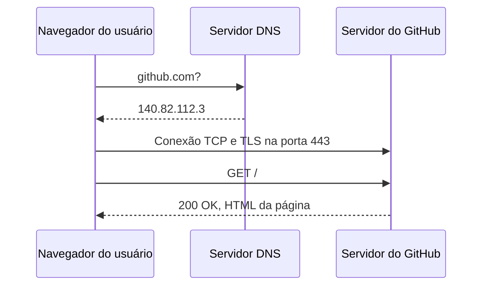

# Arquitetura da Requisição - Clínica Vida+

## O caminho de uma requisição



## Evidência do DNS

O comando `nslookup github.com` foi utilizado para consultar o endereço IP associado ao domínio.

```text
Server:         127.0.0.53
Address:        127.0.0.53#53

Non-authoritative answer:
Name:   github.com
Address: 140.82.112.3
```

O `ping github.com` resolveu o domínio para o endereço `140.82.112.4`. O endereço foi diferente do retornado pelo `nslookup`, o que pode ocorrer porque o GitHub utiliza múltiplos endereços IP para atender suas requisições.


## Evidência do HTTP

As requisições abaixo foram observadas na aba Network (Rede) do DevTools do navegador.

| Método | Recurso | Status |
|---|---|---|
| GET | sex.f291aabbce60ef7b.module.css | 200 OK |
| GET | react-jsx-runtime-4915cb0f5b3aff04.js | 200 OK |
| GET | /u/316763469?s=168&v=4 | 304 Not Modified |
| GET | https://github.com/ | 200 OK |

### Cabeçalhos observados

Em uma das requisições CSS foram identificados os seguintes cabeçalhos:

- **Host:** `github.githubassets.com`
- **User-Agent:** `Mozilla/5.0 (Windows NT 10.0; Win64; x64) ... Chrome/152...`
- **Content-Type:** `text/css`

### Teste de recurso inexistente

Também foi acessado um endereço inexistente para verificar a resposta HTTP:

`https://github.com/pagina-que-nao-existe-123456789`

O servidor respondeu com o código de status **404 Not Found**, indicando que o recurso solicitado não existe.


## Importância do HTTPS

O formulário de agendamento da Clínica Vida+ precisa utilizar HTTPS para proteger
os dados enviados pelos pacientes durante a comunicação com o servidor. Informações
sensíveis, como nome, telefone e dados relacionados à consulta, não devem trafegar
pela internet sem proteção. O HTTPS utiliza criptografia, ajudando a impedir que
essas informações sejam interceptadas ou alteradas durante a transmissão.